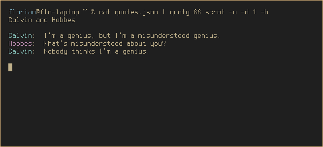

# Terminal quotes
This module should be globally installed and provides a tool to prettyprint quotes to your terminal.

```bash
npm install -g quoty
cat quotes.json | quoty
```

**quotes.json**
```json
{
	"name": "Calvin and Hobbes",
	"quotes": [{
		"dialog": [
		    {
				"person": "Calvin",
		    	"text": "I'm a genius, but I'm a misunderstood genius."
		    },
		    {
		    	"person": "Hobbes",
		    	"text": "What's misunderstood about you?"
		    },
		    {
				"person": "Calvin",
				"text": "Nobody thinks I'm a genius."
		    }
		]
	}]
}
```
If a line of dialog has no `person` property, it will be treated as a scene description. If multiple quotes are provided, one is picked at random.

**Output**


